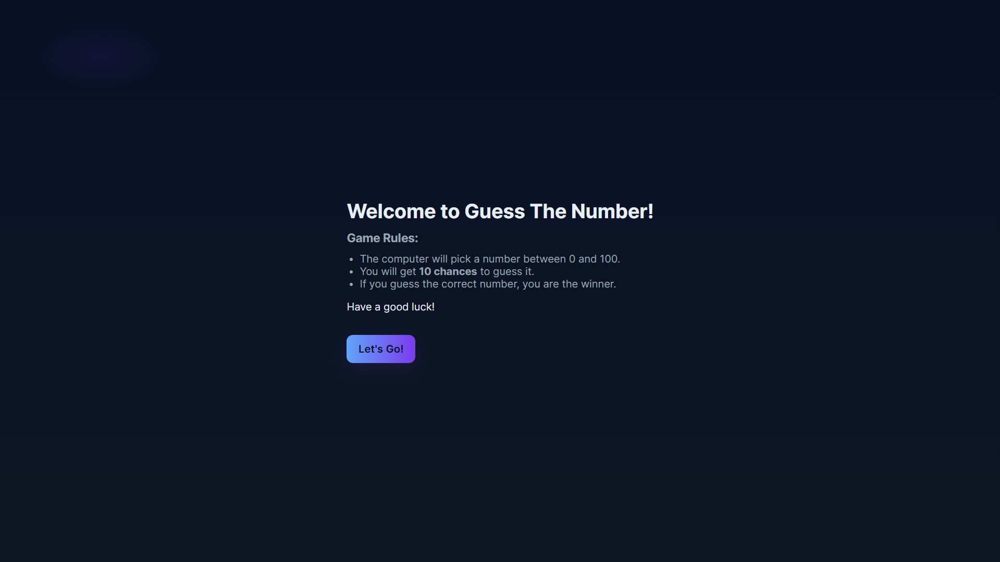
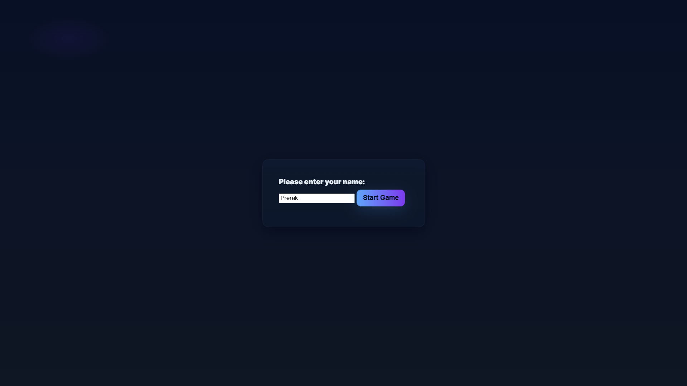

# Guess the Number Game

An interactive, modern number guessing game built with HTML, CSS, and JavaScript.

## Features

- Clean, responsive, and professional UI
- Dark glassmorphic theme
- User-friendly name entry (no browser prompt)
- 10 attempts to guess a random number between 0 and 100
- Real-time feedback on each guess (too high/low)
- Play Again and Exit options
- Fully client-side, no dependencies

## How to Play

1. Open `index.html` in your browser.
2. Click **Let's Go!** to start the game.
3. Enter your name in the form and click **Start Game**.
4. Enter a number between 0 and 100 and click **Guess**.
5. The game will tell you if your guess is too high, too low, or correct.
6. You have 10 attempts to guess the number.
7. After the game ends, you can play again or exit to the home screen.

## Project Structure

```
├── index.html        # Landing page
├── game.html         # Main game interface
├── script.js         # Game logic
├── style.css         # Stylesheet
└── README.md         # Project info
```

## Screenshots





## Credits

- Developed by Vraj Tank
- Inspired by classic number guessing games

---

Feel free to fork, modify, and share!
